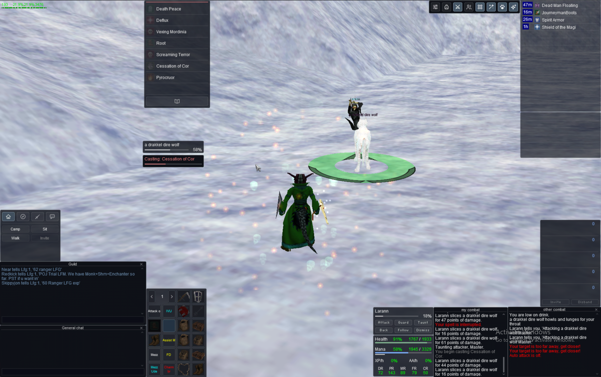
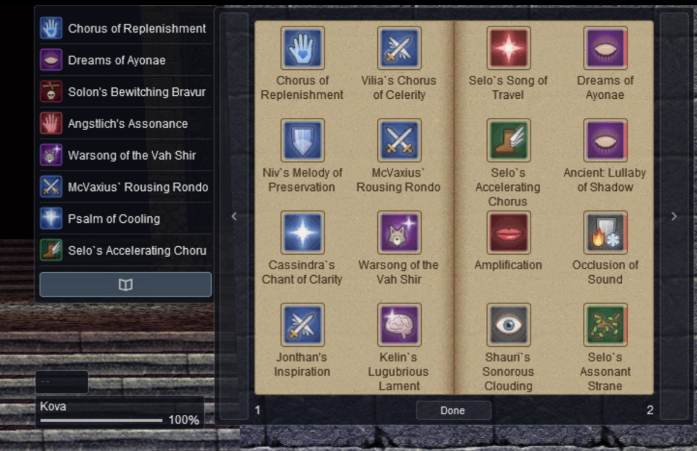
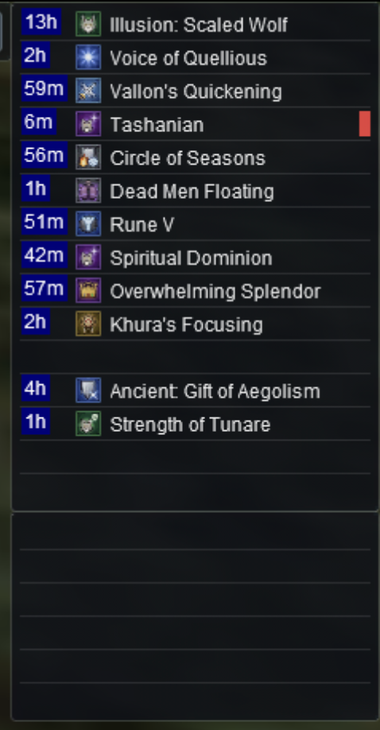

# TriageUI

EverQuest windows for Project Quarm in the look of the EQ Triage overlays · v1.0.1 · by Sebik &lt;Europa&gt;

TriageUI restyles EverQuest's own windows with the clean look of [EQ Triage](https://github.com/CopperGlade/EQTriage)'s overlays. It's a UI skin: it only changes how windows look, and it never plays for you. Every window it hasn't redesigned keeps EverQuest's own look.

## Install

1. Download `TriageUI-vX.Y.Z.zip` from the [latest release](https://github.com/CopperGlade/TriageUI/releases/latest).
2. Open the zip and drag its `TriageUI` folder into `C:\QUARM\uifiles`. Your other skins aren't touched.
3. In game, type `/load TriageUI 1`. To go back, `/load duxaUI 1` (or whatever your old skin is called).

> [!WARNING]
> **Never leave out the `1`.** It keeps your window layout. Without it the windows jump to the skin's default spots, and `/load` saves that, so even `/load duxaUI 1` afterwards brings back the jumbled layout. Copy your character's `UI_<name>_pq.proj.ini` from your EverQuest folder somewhere safe before trying a new skin.

**Updating:** download the new zip, delete your old `C:\QUARM\uifiles\TriageUI` folder, drag the new one in, then type `/reloadskin` (from Zeal) or `/load TriageUI 1`. Your layout is kept. `TriageUI.txt` in the folder says which version you have.

**Building it yourself**, to build it on another skin of yours (so the windows TriageUI hasn't redesigned take that skin's look) or for an EverQuest folder that isn't `C:\QUARM`: install [Python 3](https://www.python.org/downloads/), download the release's **Source code (zip)**, and in the extracted folder run `python build_skin.py`. It replaces `C:\QUARM\uifiles\TriageUI`. Options: `--eq D:\Games\QUARM` for your EverQuest folder, `--base NAME` for the skin to build on, `--out PATH` to build elsewhere.

## The look

Quiet and dark, so the game stays in front. Every window sits on the overlays' dark panel with a faint rounded edge and, with few exceptions, no title bar. Text is white in EverQuest's own font, and color is kept for what it tells you: green for your values, soft blue for mana and your group, grey for pets, soft red for casting and harmful effects, golden yellow for XP and AA. Bars are thin and soft. Effects, songs and spell gems are tables, a row each; click anywhere on a row to act on it. Buttons are a faint wash that turns solid while you point at them. The same small gap sits between everything.

- **Moving:** drag a window by its background, a chat window by the strip along its top. Only chat windows can be resized.
- **Fading:** the panel is solid, so each window is as see-through as you set it. The overlays' look is about `Alpha=217` in your character's `UI_<name>_pq.proj.ini`, which EverQuest keeps per character; edit it only while camped.

## The windows

- **Player:** health and mana with their % and current/max over thin bars, the server tick under the mana bar (it drains to empty at each tick; `/tickreverse` flips it), XP/h and AA/h, and your resists. The Zeal values start over when you `/load` a skin or type `/resetexp`.
- **Target:** the name on a line of its own over a thin health bar and the %.
- **Group:** each member on a line with their health, and their pet on an indented grey line under them. **Click anywhere on a row to target it.** Empty slots show nothing.
- **Raid:** everyone in two lists, grouped and **Not in a group**, with the buttons under them.
- **Pet:** the pet's name and health, then six commands in pairs. There's no Sit button; type `/pet sit`.
- **Casting** and **Air:** the target window's size, a line of text over a bar.
- **Effects and songs:** a row per effect with Zeal's time left, the icon and the name, and a red bar at the end of a harmful one's row (the game won't let a skin color the name). **Click anywhere on a row to click that effect off.** The time left needs Zeal's **Buff Timers** option.
- **Spell bar:** a row per spell gem, with its icon and the spell's name. **Click anywhere on a row to cast.** A thin white bar under the name counts down the recast, and a soft red bar along the top the global cooldown, both from Zeal. The wide book button under the gems opens and closes your spell book; right-click it for Zeal's spell sets, or an empty gem for its spell picker.
- **Spell book:** parchment pages with each spell's icon in a frame and its name under it. **Click an icon** to pick it (the frame under your mouse lights gold); right-click to move it. **Previous** and **Next** run down the whole sides, so you can click them fast.
- **Spell icons:** every spell's icon is TriageUI's own: a painted picture on a tile in the color of the spell's kind, following duxaUI's pictures so they're easy to recognize.
- **Hot buttons:** duxaUI's shape: the page arrows and ten hot buttons on the left, your weapon slots and eight bag slots on the right.
- **Actions:** the four pages behind icon tabs (point at a tab for its name). Follow replaces Invite during an invitation and joins the group. Socials 4 to 6 and 10 to 12 are hidden to keep the window short, and there's no Who or Disband: use `/who` and the group window.
- **Window selector:** a line icon on each button, lit while its window is open. There's no Help button.
- **Chat:** see *The chat windows*.
- **Inventory:** your gear laid out as in EverQuest's own window, your XP and AA in the middle, your stats and coins on the right. Drop an item anywhere in the middle to equip it. Your HP and resists are in the player window, your bags in the hot button window.
- **Bag:** slots two to a row; **Combine** over **Done** in a tradeskill container.
- **Inspect:** their gear where your inventory shows yours, their message in the middle.
- **Merchant:** all 80 slots eight to a row, nothing to scroll; Project Quarm's **Recharge** beside an item with charges. The merchant's name isn't shown.
- **Item:** the name on a title bar with **Close**, the icon and the details beside it, scrolling when they don't fit.
- **Confirmation dialog** and **Quantity:** roomier. In the quantity window, delete the number shown before typing a new one.
- **Give**, **Trade**, **Loot** and **Bank:** slots in rows with the coin boxes **pp**, **gp**, **sp** and **cp**; drop coins on their box. Loot has Zeal's **Link All** and **Loot All**, the bank Zeal's **Change**.
- **Skills:** click **Skill** or **Value** to sort (from Zeal). **Tracking:** a button per con color along the top. **Alternate advancement**, **Friends** and **Compass:** the same controls in the same look.

## The chat windows

A thin strip along the top carries the window's name and a small **X** that closes it; the chat sits straight on the panel, and the line you type on a darker strip along the bottom. **Drag the strip along the top to move a chat window;** resize it from its edges.

**Don't blank a chat window's name with a space.** Zeal takes a chat window whose name starts with a space for one of its tell windows, and EverQuest leaves it out at your next login, with everything its filters were showing. If one is gone, see Troubleshooting.

## Limits

- The text is EverQuest's built-in font, not the overlays' Segoe UI.
- A skin sets each text's color once: names can't turn red at low health, and the game colors your max HP and resists itself.
- The game draws the red box around the player window while you auto-attack, writes the item window's title and places its Close button itself, and shows the name of the item you're considering at a merchant only in chat. No skin changes those.

## Troubleshooting

- **Windows won't delete or replace the `TriageUI` folder:** EverQuest is using it. Type `/load default 1`, replace it, then `/load TriageUI 1`.
- **The game crashes while logging in:** EverQuest loads your last skin at every login. While logged out, change `UISkin=triageui` to `UISkin=default` under `[Main]` in `UI_<name>_pq.proj.ini`, then update TriageUI once there's a fix.
- **Something looks wrong in game:** `UIErrors.txt` in your EverQuest folder lists skin problems; lines mentioning `TUI_` or a window's name are about TriageUI.
- **An effect won't click off:** make sure Zeal's **Buff click thru** option is off, or unlock the window.
- **A chat window is gone after logging in, or `/who` shows nothing:** its name started with a space (see *The chat windows*). While logged out, in `UI_<name>_pq.proj.ini` change that window's `ChatWindow<n>_Language=@42` under `[ChatManager]` to `ChatWindow<n>_Language=0` and give its `ChatWindow<n>_Name` a name that doesn't start with a space. Or make a new chat window and set its filters again.
- **After updating:** type `/reloadskin` (from Zeal) to see the changes.

## Credits

The hot button window's shape, bag slots two to a row, the loot window's **Link All** and **Loot All**, the bank's **Change** and the spell icons' pictures borrow ideas from duxaUI, Duxa's skin based on Savok's port of VertUI. TriageUI includes none of duxaUI's files: its windows and art are its own, and everything else is EverQuest's.

## License

TriageUI is copyright 2026 Sebik &lt;Europa&gt;, under the [Creative Commons Attribution-NonCommercial-ShareAlike 4.0](LICENSE) license (CC BY-NC-SA 4.0): use it and change it as you like, share it with credit to Sebik &lt;Europa&gt; and a link to [TriageUI](https://github.com/CopperGlade/TriageUI) under the same license, and ask first before charging for it in any form ([open an issue](https://github.com/CopperGlade/TriageUI/issues)). Only TriageUI's pieces of `EQUI_Animations.xml` are TriageUI's: the rest is EverQuest's own.

## Development

The builder uses only Python's standard library. The tests need Pillow and pytest (`pip install -r requirements-dev.txt`, then `python -m pytest tests`). `python tools/preview.py` draws every window as a PNG into `build/preview` without starting the game; give it a word from a window's file name, such as `quantity`, to draw just that one.
