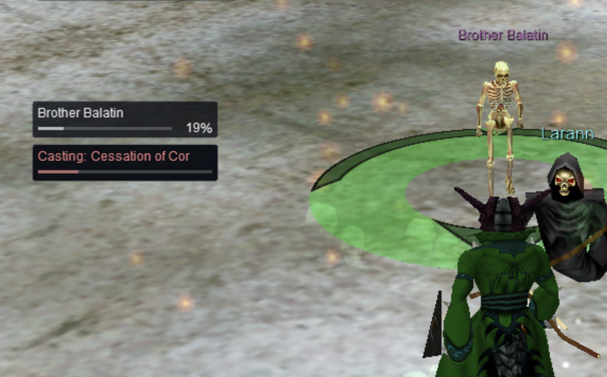
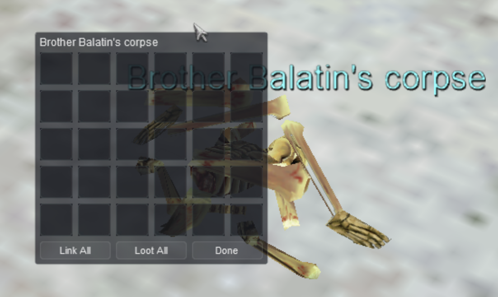
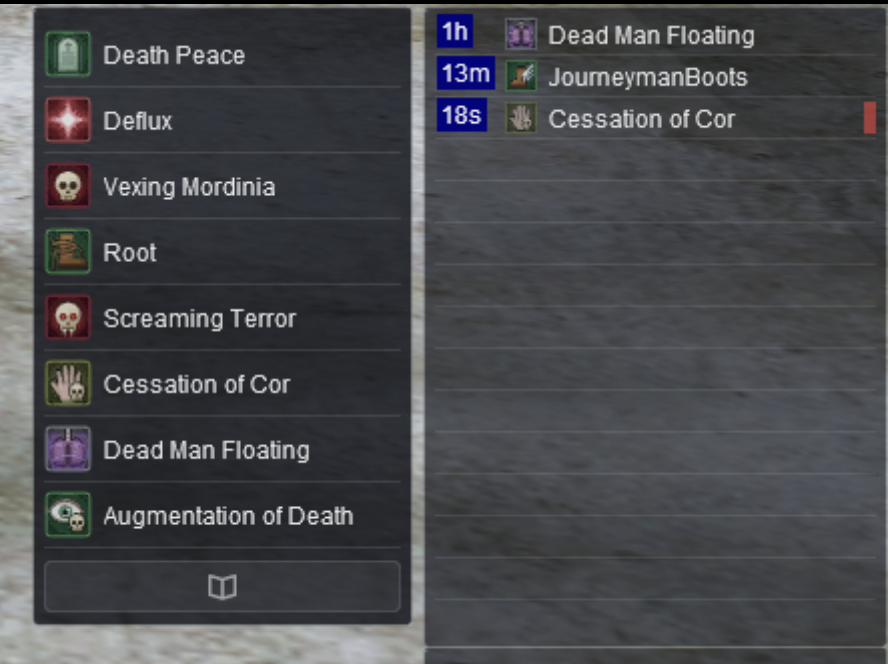
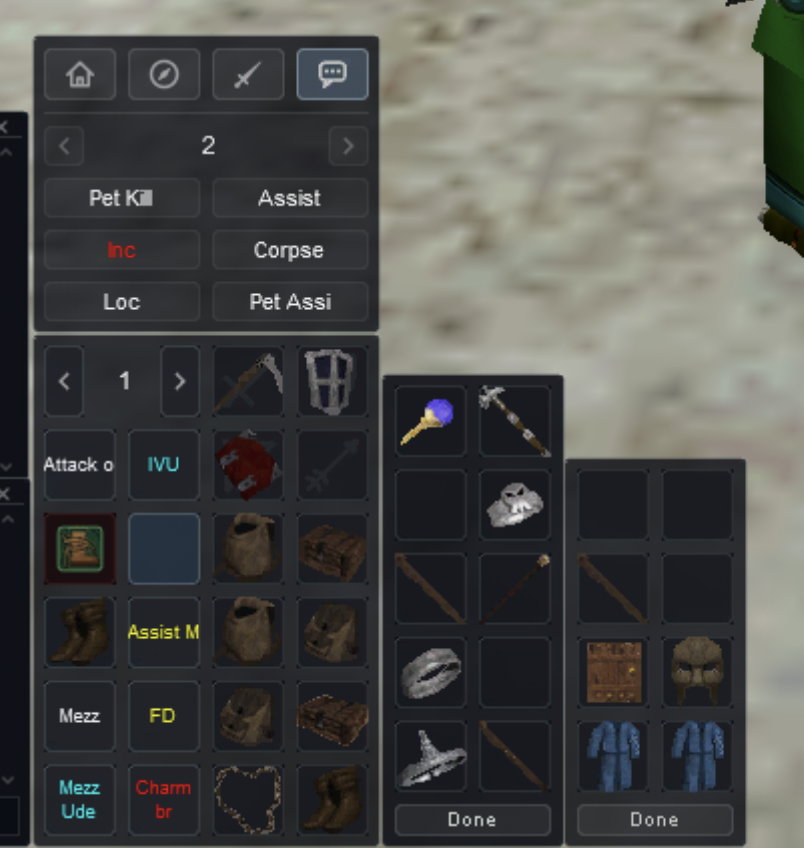
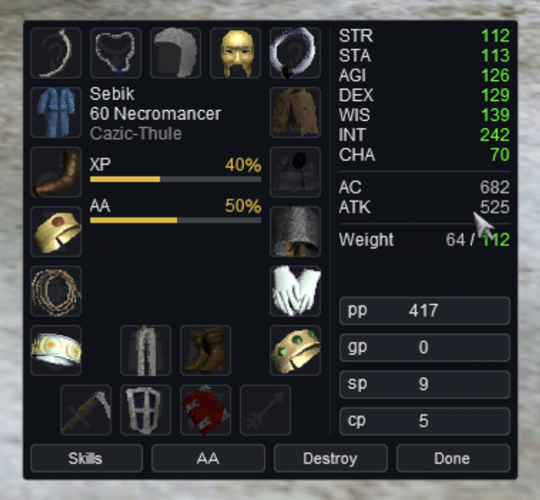

# TriageUI

EverQuest windows for Project Quarm in the look of the EQ Triage overlays · v1.0.0 · by Sebik &lt;Europa&gt;

TriageUI restyles EverQuest's own windows with the clean look of [EQ Triage](https://github.com/CopperGlade/EQTriage)'s overlays. It's a UI skin: it only changes how windows look, and it never plays for you. Every window it hasn't redesigned keeps EverQuest's own look.



## The look

Quiet and dark, so the game stays in front: each window shows what you need at a glance, then stays out of the way.

- **One dark panel.** Every window sits on the overlays' dark panel with a faint rounded edge. Almost none has a title bar, like the overlays with their header bar hidden. The exceptions are a really thin strip on the chat windows, a bar with **Close** on the item and quantity windows, and the player's name on the inspect window.
- **Plain text, color with a meaning.** Text is white, in EverQuest's own font. Color is kept for what it tells you: green for your values, as EverQuest colors a raised stat; soft blue for mana and your group; grey for pets; soft red for casting and harmful effects; cyan for air; classic golden yellow for XP and AA; and each con color in the tracking window. The spell book is the one window that leaves the dark look, with parchment pages inside a dark cover.
- **Thin, soft bars.** Health, mana, casting and recast bars are thin lines in soft colors that don't glare next to the text. Where the full length matters, as on the target's health, a faint track shows it.
- **Rows, not grids.** Your effects, songs and spell gems are tables: a row each with the icon and the name, and a faint line between rows. Click anywhere on a row to act on it. In the group window, each pet gets a row of its own.
- **Quiet buttons.** A faint wash with a thin outline, solid slate while you point at them. Their names are TriageUI's own crisp pixel lettering, or EverQuest's small font on the taller buttons of the dialogs and bigger windows. Buttons that open a window, like the window selector's, carry simple line icons and stay lit while it's open.
- **Even spacing, matching widths.** The same small gap everywhere: from a window's edge to what's inside it, and between everything in it. Dialogs get twice that room, so a question stands out. Windows that stack share their widths: the group, pet, actions, player and hot button windows are one width, and the target, casting and air windows are one size.

### Moving and fading

- **Moving:** drag a window by its background. Drag a chat window by the strip along its top, and an item, quantity or inspect window by its title bar. Only chat windows can be resized; the rest have a fixed size.
- **Closing:** a window with no close box closes with its **Done** or **Cancel** button, Esc, or the button that opened it.
- **Fading:** the panel is solid, so each window is as see-through as you set it. EverQuest keeps a transparency and a fade for every window, per character: `Alpha` (0 to 255), `FadeToAlpha` (what it fades to when the pointer leaves) and `Fades` in your character's `UI_<name>_pq.proj.ini`. The overlays' look is about `Alpha=217` (85%). Edit that file only while the character is camped: logging in and `/load` rewrite it.

## The windows

TriageUI has redesigned these. The ones that differ most from EverQuest's own have a section of their own below.

- **Player:** health, mana, the server tick, XP and AA per hour and your resists (see *The player window*).
- **Target:** the name on a line of its own, so long mob names fit, over a thin health bar and the %. With nothing targeted, only the empty bar shows. It's a little narrower than the others, and sits well next to EQ Triage's Distance overlay.
- **Group:** each member and each pet on a row of its own (see *The group window*).
- **Raid:** everyone in two lists, those in a group and those **Not in a group**, with group, name, class and rank. There's no level column, player count or average level. Two rows of buttons under the lists, among them **Options** for the class colors; point at one for what it does.
- **Pet:** the target window's shape: the pet's name, then its health bar and %, then six commands in pairs, **Attack** over **Back**, **Guard** over **Follow** and **Taunt** over **Dismiss**. There's no Sit button; type `/pet sit`.
- **Casting:** **Casting:** and the spell's name (from Zeal) in soft red, over a bar that fills as the cast completes. It's the target window's size, so the two line up when stacked. The game gives skins no cast time as a number.
- **Air:** **Air Remaining** in cyan, over a bar that empties as your air runs out. It's the casting window's size.
- **Effects and songs:** tables, a row per effect (see *The effects and songs windows*).
- **Spell bar:** a row per spell gem, with its recast (see *The spell bar*).
- **Spell book:** parchment pages, built for picking a spell in a hurry (see *The spell book*).
- **Hot buttons:** your hot buttons beside your weapon and bag slots (see *The hot button window*).
- **Actions:** four pages behind icon tabs, with some buttons and socials left out (see *The actions window*).
- **Window selector:** a line icon on each button (point at one for its name), lit while its window is open. There's no Help button.
- **Chat:** a thin strip along the top and the chat straight on the panel (see *The chat windows*).
- **Inventory:** your gear around your XP and AA, with your stats and coins beside them (see *The inventory window*).
- **Bag:** slots two to a row, as in duxaUI, with **Combine** over **Done** in a tradeskill container. The game sizes the window to each bag; the bag's name isn't shown.
- **Inspect:** their gear where your inventory shows yours, and their message in the middle. EverQuest writes their name on the title bar. With Zeal, Alt+click one of their items to open it in the item window.
- **Merchant:** all 80 slots at once, eight to a row, so there's nothing to scroll, and the item you're considering under them. For one of your items with charges, Project Quarm's recharge shows beside it: its charges, the next charge's price and **Recharge**. The merchant's name isn't shown.
- **Item:** the name on a title bar with **Close**, the icon at the top left and the details beside it, which scroll when they don't fit (Page Up and Page Down work too). Zeal's extra item windows look the same.
- **Confirmation dialog:** twice the usual room around the question and the buttons, with room for three lines. For a question with a time limit, such as a resurrection, Zeal shows the time left at its top right.
- **Quantity:** the item window's title bar with **Quantity** and **Close**, a slider, and the number beside **Accept**. What you type is added after the number shown, so delete it first to type a new one. Enter or Accept takes that many; Close or Esc takes none.
- **Give:** the NPC's name along the top, your four slots in a row and the coin boxes, **pp**, **gp**, **sp** and **cp**. Drop coins from your inventory on their box.
- **Trade:** their offer on the left under their name, and yours on the right under yours, each with eight slots and its coin boxes. An amount of 100,000 or more of one coin runs into its name.
- **Loot:** all 30 slots six to a row, so there's nothing to scroll, with Zeal's **Link All** and **Loot All** beside **Done**.
- **Bank:** the shared bank's ten slots beside your 30, both in EverQuest's own order, with your bank's coin boxes under them. **Change** is Zeal's button for changing your coins, your bank's and then your inventory's.
- **Skills:** one list, with no rank column. Click **Skill** or **Value** to sort by it, and again to reverse it (from Zeal).
- **Tracking:** a button for each con color along the top, bright while that color is listed and dim while it's filtered out. **Sort** and **Players** open their choices over the list, where each name is in its con color.
- **Alternate advancement:** the five tabs with their names on them, the abilities, and the selected one's description under them. On the right: your **Points spent** and those **Available**, **XP to AA allocation** with **-** and **+**, the selected ability's **Reuse** time or Ready, and **Train**, **Hotkey** and **Done**. Your AA XP is in the inventory window.
- **Friends:** **Friends** and **Ignored** on two tabs, with **Add** and **Delete** under the list, and **Contact** and **Who** on the Friends tab. Close it with the window selector's Friends button.
- **Compass:** a strip of directions sliding past a soft red line: the direction under the line is the way you face. **N** is soft red too, and a faint tick marks every 10°.
- **Spell icons:** every spell's icon is TriageUI's own (see *The spell icons*).



## The player window

Just what you need at a glance:
- **Health** and **Mana**, each with its % in the middle of the line, your current/max on the right and a bar under it, soft green for health and soft blue for mana. Mana's current/max come from Zeal.
- Just under the mana bar, a thin white line shows the server tick (from Zeal). It drains to empty at each tick, the moment your mana and health come in, so you can stand up to cast right after one. Type `/tickreverse` to have it fill up to the tick instead.
- **XP/h** and **AA/h** on one line, from Zeal: the percent of a level, and of an AA point, you're gaining an hour, each averaged over up to the last two hours. Both start over when you `/load` a skin; type `/resetexp` to start them over yourself. XP/h counts regular experience only, so it reads 0% while your AA experience is at 100%, and AA/h reads 0% while it's at 0%.
- Your resists as a small table, **DR**, **PR**, **MR**, **FR** and **CR**, each over its value.

The values are green, with a white slash between current and max. The game colors your max HP and resists itself, whatever a skin sets: green while buffs or gear raise them, grey at their base and red while lowered.

## The group window

Each member is a line: their name and their health %, both in soft blue, with a thin health bar in the same blue under the name. A faint line separates each member from the one above. Empty slots show nothing, not even a 0. Under each member, their pet gets an indented line of its own, its name smaller and in grey over a thin grey health bar: the game gives skins no number for a pet's health.

**Click anywhere on a row to target that member or pet.** Pet rows are as easy to click as members', instead of the hairline pet bars of most skins.

The buttons along the bottom are **Invite** and **Disband**. While you have an invitation, **Follow** (accept) and **Decline** take their place.

## The effects and songs windows

Your effects as a table, like the EQ Triage overlays: a row for each with the time left, the spell icon and its name, and a faint line between rows. A harmful effect gets a red bar at the end of its row (the game gives a skin no way to color the name itself). The songs window (short effects such as bard songs, with names from Zeal) is the same table with six rows. The time left comes from Zeal's **Buff Timers** option, which draws it at the start of each row, in a column of its own. Both windows are a little wider than the others, so longer effect names fit. **Click anywhere on a row to click that effect off**; pointing at a row shows the effect's name.

Both windows share the game's blue and red effect backgrounds with a few other windows. TriageUI replaces them with see-through ones, with only the red bar on a harmful one's, so the combat ability window loses its bright blue and red behind icons too. The item window puts them behind a spell's icon, where the bar is hidden, and the spell book squeezes the bar into a thin line beside a detrimental spell's icon.

## The spell bar

Your memorized spells as a table, like the effects window: a roomy row for each spell gem with its icon and the spell's name, and a faint line under each row. **Click anywhere on a row to cast that spell.**



A thin white bar under a spell's name shows how long until you can cast it again. A soft red bar along the top of the window shows the short global cooldown after every cast. Both come from Zeal.

In a row of its own under the gems, a wide button with a book, across the whole window so it's easy to hit in a hurry, opens and closes your spell book. It stays lit while the book is open. Zeal's right-click menus are where they always are: right-click an empty gem to pick a spell, or the book button for your spell sets.

## The spell book

Built so you can find and pick a spell quickly in a fight. The two open pages are parchment, shaded toward the spine like a real book, inside the window's dark cover. Each page holds eight spells, two across and four down, in the same spots as in EverQuest's own book. Each spell's icon sits at full size in a thin brown frame, with its name in dark ink centered under it on up to three lines, so every name any class can scribe fits. An empty spot shows an empty frame, so you can see where your next spell will go. **Click a spell's icon** to pick it. The frame under your mouse lights gold, so you can see which spell you'll get before you click. Clicking a name does nothing.

**Previous** and **Next** run down the whole left and right sides of the window as tall strips with an arrow in the middle. They never move, so you can click one again and again to turn pages quickly. A small gap between each strip and the spells means a click that misses a strip never picks up a spell.

A detrimental spell has a thin red line down the right side of its icon. To move a spell, **right-click it**: a thin red line flickers beside it until you right-click the spot to swap it with. Right-click the same spell again to put it back.

While you memorize or scribe a spell, a thin soft red bar along the top of the window shows how far along it is. Along the bottom are each page's number, under its page, and **Done** in the middle. Click Done or the spell bar's book button to close the book.

## The spell icons

Every spell's icon is TriageUI's own, wherever the game shows it: the spell bar, your hot buttons, the effects and songs windows, the spell book and the item window. Each is a small painted picture on a rounded tile in the color of the spell's kind: blue for heals and buffs, red for harm, orange for fire, ice blue for cold, green for nature, poison and travel, olive for disease, purple for the enchanter's and mind spells, and so on. The pictures follow duxaUI's, so they're easy to recognize: a blue hand with a heart for a heal, a leather boot with a wing for run speed, a hand holding a green vial for poison. Each object is in its own colors, outlined and shaded, with a soft glow.

Every spell in Project Quarm has its picture. While TriageUI is loaded, its icons replace every other skin's.

## The hot button window

Your hot bar in duxaUI's shape, so everything is where you're used to it, on a grid of square buttons. On the left, the page arrows with the page number between them, and your ten hot buttons under them, two to a row, each with its name in the game's small font (or the item's or spell's icon). On the right, your **Primary** and **Secondary**, **Range** and **Ammo** slots, then your eight bag slots in two columns, 1 to 4 and 5 to 8. An empty weapon slot shows a large, faint icon of what goes there: a sword, a shield, a bow and an arrow. An empty bag slot is a plain square.



## The actions window

The game's four pages behind a row of icon tabs in the window selector's style: **Main** (a house), **General Skills** (a compass), **Combat Skills** (a sword) and **Socials** (a speech bubble). The open page's tab is lit. Point at a tab for its page's name. On every page the actions are two columns of buttons, their names in a small font.

- **Main:** **Camp**, **Sit** or **Stand**, **Run** or **Walk** (the game shows whichever you can switch to), and **Invite**, which becomes **Follow** while you have a group invitation: Follow joins the group. It doesn't follow your target; for that, make a hot button with `/follow`. There's no Who or Disband: use `/who`, or the group window's Disband button.
- **General Skills** (the game's Abilities page): your six skill buttons, such as Sense Heading, Forage or Hide. The game writes each skill's name on its button.
- **Combat Skills** (the game's Combat page): **Melee Attack** and **Range Attack**, then your four combat skills, such as Kick or Taunt.
- **Socials:** six of the twelve socials on each social page, 1 to 3 and 7 to 9, under the page arrows and the page number. Socials 4, 5, 6, 10, 11 and 12 are hidden to keep the window short: put what you need in the slots shown, or on a hot bar.

The game needs all four pages: it sends a button's click to the page that's open, so a button moved to another page would stop working.

## The chat windows

Every chat window is the same: a thin strip along the top with the window's name in small text in the middle (EverQuest writes the name there; a skin can't leave it off) and a small **X** at the right end that closes the window, the chat straight on the panel with a slim scrollbar, and the line you type on a plain strip along the bottom, a little darker than the window, with a faint outline.

**To move a chat window, drag the thin strip along its top.** Resize it from its edges. The strip is there because EverQuest won't let you drag a resizable window that has no title bar.

**Don't blank a chat window's name with a space.** Zeal takes a chat window whose name starts with a space for one of its tell windows, even with tell windows off, and EverQuest leaves it out at your next login. Everything its filters were showing, `/who` included, then goes nowhere. Only your main chat window comes back anyway. If one is gone, see Troubleshooting.

## The inventory window



Your gear is laid out as in EverQuest's own inventory, on the hot button window's squares:
- ears, neck, head and face along the top;
- chest, arms, wrist, waist and ring down the left side;
- back, shoulders, wrist, hands and ring down the right side;
- legs and feet between the rings, and your weapons under them.

An empty slot shows a large, faint icon of what goes there, like the hot button window's weapon slots.

The middle shows your name, your level and class, and your deity in grey. Under them are your **XP** and **AA**, each with the % of the way to your next level or AA point and a bar under it, in classic golden yellow. Drop an item anywhere in the middle to equip it.

On the right, past a thin line:
- your stats, then your **AC** and **ATK**, then your **Weight**, each group under a thin line, the numbers in green;
- your coin boxes, **pp**, **gp**, **sp** and **cp**, wide enough for a large amount of platinum; click one to pick up some coins.

Along the bottom, **Skills** and **AA** open those windows, **Destroy** destroys the item you're holding, and **Done** closes the window. Your HP and resists are in the player window, and your bag slots in the hot button window.

## Install

1. **Get TriageUI.** Download `TriageUI-vX.Y.Z.zip` from the [latest release](https://github.com/CopperGlade/TriageUI/releases/latest).
2. **Put it in your EverQuest folder.** Open the zip and drag the `TriageUI` folder inside it into `C:\QUARM\uifiles`, so you have `C:\QUARM\uifiles\TriageUI`. It holds only TriageUI's own windows and art: for every other window, EverQuest uses its own UI files. Your other skins are never changed.
3. **Load it in game.** Type `/load TriageUI 1`. To go back, type `/load` with your old skin's name and the `1`, such as `/load duxaUI 1`.

   The `1` keeps your window layout. EverQuest saves where your windows are per character, not per skin (in `UI_Sebik_pq.proj.ini` for Sebik, in your EverQuest folder), so every skin can use the same layout. The **Load Skin** window does the same when **Keep Your Layout** is ticked.

> [!WARNING]
> **Never leave out the `1`.** `/load` saves your current window positions before it loads, and without the `1` the windows jump to the skin's default spots. After that, even `/load duxaUI 1` only brings back the jumbled positions, because they're what was saved. Copy your character's `UI_<name>_pq.proj.ini` somewhere safe before trying a new skin.

### Updating

1. Download the newest `TriageUI-vX.Y.Z.zip` from the [latest release](https://github.com/CopperGlade/TriageUI/releases/latest).
2. Delete your old `C:\QUARM\uifiles\TriageUI` folder, so nothing of the old version is left, then drag the new one from the zip into `C:\QUARM\uifiles` as when installing.
3. In game, type `/reloadskin` (from Zeal), or `/load TriageUI 1`.

Your window layout is kept: EverQuest saves it per character in your EverQuest folder, not in the skin. `TriageUI.txt` in the skin's folder says which version you have.

> [!NOTE]
> TriageUI's `EQUI_Animations.xml` is EverQuest's own with TriageUI's pieces added. If Project Quarm's patcher ever changes `uifiles\default\EQUI_Animations.xml`, get the next release or build TriageUI yourself, so it picks up the change. Don't edit the files in the `TriageUI` folder: updating and building replace them.

### Building it yourself

The release's `TriageUI` folder is built on EverQuest's own UI files. To build it on another skin of yours, so the windows TriageUI hasn't redesigned take that skin's look, or for an EverQuest folder that isn't `C:\QUARM`, build it yourself:

1. **Install Python 3** on Windows from [python.org](https://www.python.org/downloads/) if you don't have it. Nothing else is needed.
2. Download the release's **Source code (zip)** and extract it anywhere.
3. Open a command prompt in the extracted folder and run `python build_skin.py`, with any of the options below. It reads your EverQuest folder at `C:\QUARM`, replaces `C:\QUARM\uifiles\TriageUI` and prints the version it built.

| Option | Meaning |
|---|---|
| `--eq D:\Games\QUARM` | Your EverQuest folder, if it isn't `C:\QUARM`. |
| `--base NAME` | Build on another skin, a folder in `uifiles`, so the windows TriageUI hasn't redesigned take its look instead of EverQuest's own. |
| `--out PATH` | Where to build, instead of `uifiles\TriageUI`. |

## Limits

- **Fonts:** EverQuest windows can only use the game's built-in fonts, so the text is EverQuest's font rather than the overlays' Segoe UI.
- **Colors that change:** a skin sets each text's color once, so names stay white (pets grey). The overlays color names yellow and red at low health, and Zeal colors target rings by con, but a skin can do neither. The other way round, the game colors your max HP and resists itself by whether they're raised or lowered, and a skin can't stop it.
- **The red box around the player window while you auto-attack:** EverQuest draws it itself, a 1px red outline that flashes on top of the window, and no skin setting turns it off.
- **The name of the item you're considering at a merchant:** EverQuest shows it only in chat. The merchant window gets the item's icon and nothing else, so no skin can show the name.
- **The item window's title bar:** EverQuest writes the item's name in its own color and places the Close button itself, a little further from the window's edge than TriageUI's usual spacing. A skin sets neither.

## Troubleshooting

- **Windows won't delete or replace the `TriageUI` folder,** or building it yourself says **`Couldn't write ...`:** EverQuest may be using the folder. Type `/load default 1`, replace or build it, then `/load TriageUI 1`.
- **Building it yourself says `There is no skin folder C:\QUARM\uifiles\default`:** your EverQuest folder is elsewhere (use `--eq`). With `--base`, the skin you named isn't a folder in `uifiles`.
- **Building it yourself says `...TriageUI already exists and wasn't built by this script`:** a `TriageUI` folder that TriageUI didn't create is in the way. Rename it; the builder never overwrites it.
- **The game crashes while logging in or loading TriageUI:** EverQuest loads the skin your character last used at every login, so a skin that crashes it crashes every login. While logged out, open `UI_<name>_pq.proj.ini` in your EverQuest folder and change `UISkin=triageui` under `[Main]` to `UISkin=default`, then update TriageUI once there's a fix. The crash report in `crashes` in your EverQuest folder shows where it happened.
- **Something looks wrong in game:** `UIErrors.txt` in your EverQuest folder lists skin problems. Lines that mention `TargetWindow`, `GroupWindow`, `CastingWindow`, `CastSpellWnd`, `ChatWindow`, `PetInfoWindow`, `SelectorWindow`, `ActionsWindow`, `HotButtonWnd`, `ContainerWindow`, `MerchantWnd`, `BuffWindow`, `ShortDurationBuffWindow`, `PlayerWindow`, `BreathWindow`, `RaidWindow`, `ConfirmationDialogBox`, `ItemDisplayWindow`, `QuantityWnd`, `GiveWnd`, `TradeWnd`, `LootWnd`, `CompassWindow`, `BankWnd`, `SkillsWindow`, `SpellBookWnd`, `InventoryWindow`, `TrackingWnd`, `AAWindow`, `FriendsWindow`, `InspectWnd` or `TUI_` are about TriageUI.
- **An effect won't click off:** a left click anywhere on its row does it. If pointing at a row shows no name, the game isn't seeing the rows at all: update TriageUI (older builds had rows as wide as the window, which the game ignores). Otherwise make sure Zeal's **Buff click thru** option (Zeal options, General tab) is off, or unlock the window.
- **A chat window is gone after logging in, or `/who` shows nothing:** a chat window whose name started with a space is left out at login (see *The chat windows*), and its filters go nowhere. While logged out, open `UI_<name>_pq.proj.ini` in your EverQuest folder, change that window's `ChatWindow<n>_Language=@42` under `[ChatManager]` to `ChatWindow<n>_Language=0`, and give its `ChatWindow<n>_Name` a name that doesn't start with a space. Or make a new chat window in game and set its filters again.
- **After updating or building again:** type `/reloadskin` (from Zeal) to see the changes. It reloads the skin with your saved layout, like `/load TriageUI 1`.

## Credits

A few of TriageUI's windows borrow ideas from duxaUI, Duxa's skin based on Savok's port of VertUI: the hot button window's shape, with your weapon and bag slots beside the hot buttons, bag slots two to a row, the loot window's **Link All** and **Loot All**, and the bank window's **Change**. The spell icons borrow duxaUI's ideas too: each is TriageUI's own drawing of what duxaUI's icon for that spell shows, such as a blue hand for a heal or a winged boot for run speed. TriageUI includes none of duxaUI's files: its windows and art are its own, and everything else is EverQuest's. Its `EQUI_Animations.xml` is EverQuest's own with TriageUI's pieces added, as a skin's must be.

## License

TriageUI is copyright 2026 Sebik &lt;Europa&gt;, under the [Creative Commons Attribution-NonCommercial-ShareAlike 4.0](LICENSE) license (CC BY-NC-SA 4.0). In short:

- **Use it and change it** as you like.
- **Share it, changed or not,** as long as you credit Sebik &lt;Europa&gt; with a link to [TriageUI](https://github.com/CopperGlade/TriageUI), keep it free and share your version under the same license.
- **Charging for it** in any form needs permission first: [open an issue](https://github.com/CopperGlade/TriageUI/issues).

Each of the skin's XML files and `TriageUI.txt` carries a line saying so; keep it in anything you share. Only TriageUI's pieces of `EQUI_Animations.xml` are TriageUI's: the rest is EverQuest's own.

## Development

The builder uses only Python's standard library. The tests also need Pillow and pytest:

```
pip install -r requirements-dev.txt
python -m pytest tests
```

To look at the windows without starting the game, `tools/preview.py` draws them as PNGs with sample text and values (Pillow). With no arguments it draws every window into `build/preview`; give it a word from a window's file name to draw just that one:

```
python tools/preview.py quantity
```
